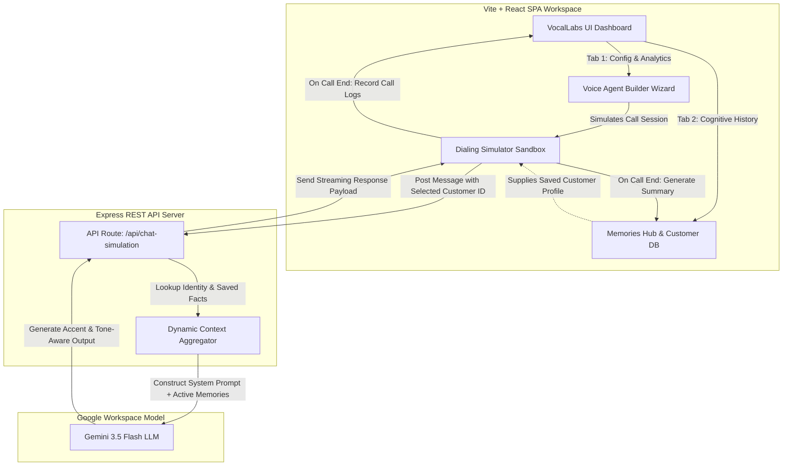

# 🎙️ VocalLabs AI Studio — Intelligent Voice Agent Platform

VocalLabs AI Studio is a full-stack engine designed to build, deploy, and simulate **Cognitive AI Voice Agents** tailored for business operations. Leveraging a real-time Express backend and raw Gemini 3.5 Flash integrations, this application introduces custom **Customer Context Memory**, historical recap utilities, and live interactive dialing simulations.

---

## 🏛️ System Architecture Diagram

This diagram displays the unified full-stack architecture. Client micro-states coordinate with the Node.js Express server to route real-time context directly into the Gemini prompt execution chain.



---

## 🧠 Cognitive Memory Pipeline Flowchart

Here is the exact cycle of how standard user parameters flow and transform into fully personalized voice dialogue.

```
 [ Caller dials on Simulator ]
               │
               ▼
┌──────────────────────────────┐
│ Look up Active Customer ID   │ ──► (e.g. Ramesh Kumar, +91 87654...)
└──────────────────────────────┘
               │
               ▼
┌──────────────────────────────┐
│ Pull Cognitive Memories Tree │ ──► (Loads historical facts, preferences)
└──────────────────────────────┘
               │
               ▼
┌──────────────────────────────┐
│ Fetch Prior Call summaries   │ ──► (Reads: "Locked in premium pack...")
└──────────────────────────────┘
               │
               ▼
┌──────────────────────────────┐
│ Express Server Aggregation   │
├──────────────────────────────┴─────────────────────────────────────────┐
│ Formulates Custom Injection Block:                                      │
│ "You have active recall memory. Greet 'Ramesh Kumar' by name.          │
│ Follow up on previous issue: 'premium benefits activation'..."          │
└─────────────────────────────────┬──────────────────────────────────────┘
                                  │
                                  ▼
                     ┌──────────────────────────┐
                     │   Gemini 3.5 Flash API   │
                     └────────────┬─────────────┘
                                  │
                                  ▼
                     ┌──────────────────────────┐
                     │ Highly Conversational   │
                     │ Context-Aware Voice Reply│
                     └──────────────────────────┘
```

---

## ⚙️ Key Functional Capabilities

### 1. 📂 Core Agent Wizard Builder
*   **Persona Selection**: Choose a variety of warm, human-like voice characteristics (accent configurations, professional tones, gender settings).
*   **Dynamic Instructions Editor**: Alter system rules on the fly to support domain-specific needs (e.g., Financial, Logistics Services, Tech Support).

### 2. 🧠 Cognitive Memories Hub (Database)
*   **Fact Memory Tokens**: Store permanent memories about callers (e.g., *“Prefers Hinglish for banking dialogues”*, *“Interested in housing loan packages”*).
*   **Prior Summary Option**: Review or manually overwrite the previous call's summary to dynamically alter subsequent voice agent actions.
*   **Provision Dynamic Profile**: Instantly generate realistic customer identities with phone handles, customized initial memories, and gradient avatars.

### 3. 💬 Real-Time Dialing Sandbox
*   **Simulate Customer Identity**: Switch from an array of pre-loaded profiles to evaluate how the voice agent adapts to individual customer parameters.
*   **Voice Jitter Simulation**: Real-time dialogue visualization styled on custom waveform representations.
*   **Dialog Playback**: Simulated voice engine playback elements built on interactive timelines.

---

## 💾 Core Directory Tree & Data Layout

Understanding our structure allows for easy navigation when extending operational scopes:

```text
├── server.ts                 # Full-stack Node Express server & API routes
├── package.json              # App metadata, bundle instructions & dev scripts
├── src/
│   ├── main.tsx              # React mounting file entry-point
│   ├── App.tsx               # Primary state orchestrator and coordinator
│   ├── types.ts              # Declarative TypeScript schemas
│   ├── data.ts               # Static presets (e.g. initial caller memories)
│   └── components/
│       ├── Dashboard.tsx     # Operations center / Cognitive Memories panel
│       ├── AgentBuilder.tsx  # Step-by-step configuration wizard + sandbox
│       └── AudioWaveform.tsx # Animated audio visual feedback component
```

---

## 🛠️ Local Development & Running

Follow these simple steps to compile and verify the platform locally:

1.  **Configure Environment**: Create a local `.env` and configure your API key safely:
    ```env
    GEMINI_API_KEY=your_google_ai_studio_api_key_here
    ```
2.  **Install Dependencies**: Read and fetch required packages from the background registry:
    ```bash
    npm install
    ```
3.  **Launch Dev Server**: Start Vite and our Express REST Layer:
    ```bash
    npm run dev
    ```
4.  **Production Compile**: Generate highly compressed bundle targets:
    ```bash
    npm run build
    ```
